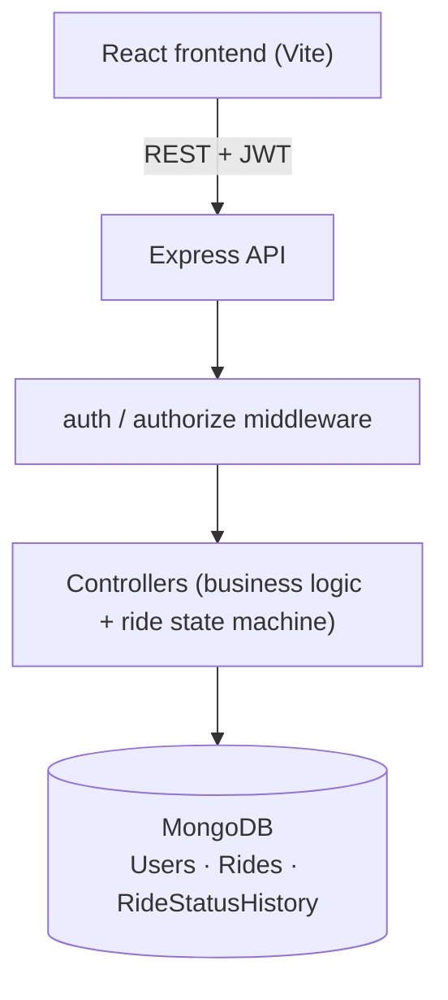

# Fleet Booking and Tracking Platform

A small full-stack ride booking app with three roles — customer, driver, and
admin — built around a defined ride lifecycle
(`REQUESTED → ACCEPTED → DRIVER_ARRIVING → STARTED → COMPLETED`, with
`CANCELLED` as a branch off the first three states).

## Problem overview

Customers request a ride with a pickup, destination, and requested time.
Drivers see unclaimed requests, accept one, and move it through the
lifecycle. Admins see every ride, can filter by status/driver/customer/date,
and see aggregate metrics (counts per status, total completed-ride revenue).
The backend enforces the state machine and role permissions server-side —
the frontend never has to be trusted for authorization.

## Technology stack

| Layer | Choice |
|---|---|
| Frontend | React 19 (Vite), React Router, Tailwind CSS |
| Backend | Node.js, Express 5 |
| Database | MongoDB (Mongoose) |
| Auth | JWT (`jsonwebtoken`), passwords hashed with `bcryptjs` |
| Validation | manual request-shape checks in controllers |
| Testing | Jest + Supertest (backend, integration-style, against a real test DB) |

## Repository layout

```
server/   Express API, MongoDB models, tests
client/   React frontend (Vite)
```

## Setup instructions

Prerequisites: Node.js 20+, a MongoDB instance (local or Atlas).

```bash
git clone <this-repo-url>
cd fleet-platform

cd server && npm install
cd ../client && npm install
```

## Environment variables

Copy the example files and fill in real values — neither `.env` file is
committed (see `.gitignore`).

**`server/.env`** (copy from `server/.env.example`)

| Variable | Description |
|---|---|
| `PORT` | Port the API listens on (default `5001`) |
| `MONGO_URI` | Connection string for the main database |
| `MONGO_TEST_URI` | Connection string for the database used by the Jest suite — **use a separate database from `MONGO_URI`**, the test suite wipes all collections between tests |
| `JWT_SECRET` | Secret used to sign/verify auth tokens — any long random string |

**`client/.env`** (copy from `client/.env.example`)

| Variable | Description |
|---|---|
| `VITE_API_URL` | Base URL of the running API, e.g. `http://localhost:5001/api` |

## Database setup

Any reachable MongoDB instance works (local `mongod`, Docker, or a free
Atlas cluster) — just point `MONGO_URI` / `MONGO_TEST_URI` at it. No manual
schema setup is needed; Mongoose creates collections and indexes on first
use.

To get usable accounts without registering by hand, run the seed script
from `server/`:

```bash
npm run seed
```

This upserts three accounts (all password `password123`):

| Role | Email |
|---|---|
| Customer | `customer@example.com` |
| Driver | `driver@example.com` |
| Admin | `admin@example.com` |

`POST /api/auth/register` only ever creates `CUSTOMER` accounts — driver and
admin accounts are provisioned via the seed script rather than self-signup,
which matches how those roles would realistically be onboarded.

## How to run the backend

```bash
cd server
npm run dev     # nodemon, auto-restarts on change
# or: npm start
```

Runs on `http://localhost:5001` by default. `GET /` returns a health-check
JSON message.

## How to run the frontend

```bash
cd client
npm run dev
```

Runs on `http://localhost:5173` by default (Vite). Make sure
`VITE_API_URL` in `client/.env` points at the running backend.

## Test instructions

```bash
cd server
npm test
```

Runs the Jest + Supertest suite (17 tests) against `MONGO_TEST_URI`,
covering registration/login, role-based authorization, ride creation,
concurrent-accept protection, valid/invalid status transitions,
cancellation rules, and ride-history recording. Collections in the test
database are wiped before each test.

To run a single test: `npm test -- --runInBand -t "test name"`.

## API documentation

All endpoints are under `/api`. Authenticated routes require
`Authorization: Bearer <token>`; the token is returned by `POST
/api/auth/login`. Role checks happen server-side in
`authorize(...roles)` middleware — a wrong-role request gets `403`
regardless of what the frontend shows.

### Auth

**`POST /api/auth/register`** — public
Body: `{ name, email, password }`
Creates a `CUSTOMER` account (role is not client-settable).
- `201` → `{ id, name, email, role }`
- `400` → missing fields
- `409` → email already registered

**`POST /api/auth/login`** — public
Body: `{ email, password }`
- `200` → `{ message, token, user: { id, name, email, role } }`
- `400` → missing fields
- `401` → wrong email/password

### Rides

**`POST /api/rides`** — role: `CUSTOMER`
Body: `{ pickupLocation, dropLocation, estimatedDistance, requestedTime, notes? }`
Server computes `estimatedFare = 50 + estimatedDistance * 10` and sets
`status: "REQUESTED"`.
- `201` → `{ message, ride }`
- `400` → missing required field
- `401` → missing/invalid token

**`GET /api/rides/my`** — role: `CUSTOMER`
Rides belonging to the logged-in customer, newest first.
- `200` → `{ count, rides }`

**`GET /api/rides/:id`** — role: `CUSTOMER`
Full ride detail plus its status history, customer/driver populated.
- `200` → `{ ride, history }`
- `403` → ride belongs to a different customer
- `404` → no such ride

**`GET /api/rides/available`** — role: `DRIVER`
Rides currently in `REQUESTED` status, customer populated.
- `200` → `{ rides }`

**`GET /api/rides/assigned`** — role: `DRIVER`
Rides assigned to the logged-in driver, newest first, customer populated.
- `200` → `{ count, rides }`

**`POST /api/rides/:id/accept`** — role: `DRIVER`
Atomically claims a ride: only succeeds if the ride is still `REQUESTED`.
- `200` → `{ message, ride }`
- `404` → ride doesn't exist
- `409` → ride exists but was already accepted/claimed by another driver

**`PATCH /api/rides/:id/status`** — role: `DRIVER`
Body: `{ status }`. Only the assigned driver may update; only transitions
allowed by the state machine succeed.
- `200` → `{ message, ride }`
- `400` → transition not allowed from the ride's current status
- `403` → caller is not the assigned driver (body is `{ msg }`, not `{ message }` — see note below)
- `404` → no such ride

**`POST /api/rides/:id/cancel`** — role: `CUSTOMER`
Only the ride's own customer may cancel, and only while the ride is
`REQUESTED`, `ACCEPTED`, or `DRIVER_ARRIVING` (not after `STARTED`).
- `200` → `{ message, ride }`
- `400` → ride is past the cancellable window
- `403` → caller doesn't own the ride
- `404` → no such ride

Every accept/status-change/cancel writes one row to `RideStatusHistory`
(`rideId`, `previousStatus`, `newStatus`, `changedBy`, `timestamp`).

### Admin

**`GET /api/admin/metrics`** — role: `ADMIN`
- `200` → `{ totalRides, requestedRides, activeRides, completedRides, cancelledRides, totalCompletedRevenue }`
  (`activeRides` = `ACCEPTED` + `DRIVER_ARRIVING` + `STARTED`)

**`GET /api/admin/rides`** — role: `ADMIN`
Query params (all optional): `status`, `driver` (driver's user id),
`customer` (customer's user id), `date` (`YYYY-MM-DD`, matches
`createdAt` within that day).
- `200` → `{ count, rides }`

### Common error shape

Errors are `{ message: "..." }`. One handler (the "not your assigned ride"
check on `PATCH /:id/status`) returns `{ msg: "..." }` instead — a small
inconsistency called out above rather than papered over. Unhandled
exceptions return `500`.

## Architecture



No external services (maps, payments, queues, notifications) are used —
fare is computed from a manually entered distance, and there's no map,
payment, or notification integration in this submission.

## Assumptions

- "Estimated distance" is entered manually by the customer rather than
  computed from real geocoding — the assignment allows this.
- Fare is a fixed formula (`base 50 + distance × 10`), not configurable
  per ride.
- A driver can hold multiple assigned rides concurrently — the app doesn't
  restrict a driver to one active ride at a time.
- Registration always creates a `CUSTOMER`; driver/admin accounts are
  provisioned out-of-band (seed script), not through the public signup
  form.
- The customer ride-detail page uses polling (every 5s) rather than
  WebSockets/SSE for status updates, per the assignment's "polling is an
  acceptable approach" note.

## Known limitations

- No refresh tokens — JWTs are valid for 7 days with no revocation
  mechanism; logging out just discards the token client-side.
- No rate limiting on `/api/auth/login`, so it's not hardened against
  brute-force attempts.
- No pagination on `GET /api/admin/rides` or `GET /api/rides/available` —
  fine at this scale, would need cursor/offset pagination for a large
  fleet.
- Concurrency protection for ride acceptance relies on MongoDB's atomic
  `findOneAndUpdate` (only one caller can match the `status: "REQUESTED"`
  filter) rather than a queue or lock — sufficient for this scale, but
  worth revisiting under heavier write contention.
- No structured logging or monitoring/alerting — errors are only
  `console.error`'d.

## Features not completed

Per the assignment, these were optional and left out to keep the core
flow solid:

- Map display / live driver location
- WebSocket or GraphQL subscription-based real-time updates (real-time
  updates could be added by swapping the customer ride-detail page's
  polling for a WebSocket room keyed by ride id, with the server pushing
  an event on every status change instead of the client re-fetching)
- OTP authentication
- Payment processing / payment webhook
- Promo codes
- Email or in-app notifications
- Docker / CI-CD / AWS deployment automation
- Audit logging beyond the ride-status history table

## AI tool usage

_Used AI tools for writing tests, building frontend partially and debugging._
